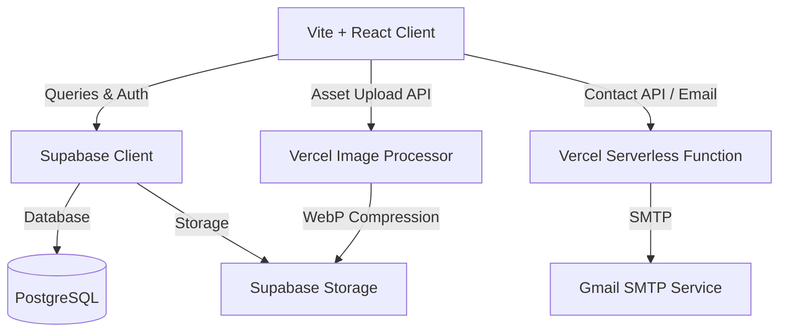

# 🚀 Dynamic Portfolio & Content Management System

[](https://react.dev/)
[](https://supabase.com/)
[](https://vercel.com/)
[](https://tailwindcss.com/)

A modern, high-performance personal portfolio and dynamic Content Management System (CMS) designed to bridge the gap between Technical Software Engineering and Creative Arts. This is not a static portfolio — it is a fully dynamic, database-driven platform powered by Supabase, React, and Vercel serverless functions, featuring a custom secured admin control center.

---

## 🌟 Core Portals

### 1️⃣ Technical Engineering Showcase (`/technical`)
A sleek, developer-centric interface displaying professional works, credentials, and capabilities.
* **Split-Screen Hero**: Smooth, reactive interactive transitions with customized theme support.
* **Dynamic Projects List**: Highlights live status badges, completion progress, GitHub links, and live preview links.
* **Interactive Skill Matrices**: Managed entirely through the admin dashboard.
* **Timeline**: Interactive timeline tracking experience and career path.

### 2️⃣ Creative Photography & Studio (`/photoshoots` & `/artistic`)
A visually immersive, high-performance photography showcase.
* **Masonry Galleries**: Responsive masonry layout optimized for large assets and quick loads.
* **Lightbox Experience**: Immersive Zoom, drag, and high-fidelity rendering of creative media.
* **Artistic Archive**: Dedicated portal for sketches, illustrations, and art pieces.

### 3️⃣ Achievements Hub (`/achievement`)
A centralized credential verification system.
* **3D Animated Folders**: Interactive folders grouping college achievements, extracurricular awards, online courses, and professional credentials.
* **Verification Proofs**: Attach clickable certificate links and descriptions directly to achievements.

### 🔐 Admin Command Center (`/admin`)
A role-based, secure headless CMS that controls all application data in real-time.
* **Secured Access**: Fully integrated with Supabase GoTrue Auth.
* **Data Control Panels**: Add, update, delete, draft, and publish projects, skills, timeline cards, and achievements.
* **Media Manager**: Drag-and-drop file uploader that converts raw images to high-performance WebP formats on-the-fly via backend processing.
* **Draft Mode**: Draft indicators showing unsaved modifications or offline-sync indicators.

---

## ⚙️ Environment Configuration

To run this application locally, you must create a `.env` file in the root directory. Use `.env.example` as a template:

```bash
# Supabase Configuration
VITE_SUPABASE_PROJECT_ID=chaiilxwjcveubnjmxfv
VITE_SUPABASE_URL=https://chaiilxwjcveubnjmxfv.supabase.co
VITE_SUPABASE_PUBLISHABLE_KEY=your-supabase-anon-publishable-key-here
VITE_SUPABASE_ANON_KEY=your-supabase-anon-publishable-key-here

# Supabase Service Role Key (Keep secure, used by serverless functions)
SUPABASE_SERVICE_ROLE_KEY=your-supabase-service-role-key-here

# Email SMTP Configuration (Gmail)
OFFICIAL_EMAIL=ankurrera@gmail.com
GMAIL_USER=ankurr.tf@gmail.com
GMAIL_PASSWORD=your_gmail_app_password_here
```

> [!NOTE]
> For `GMAIL_PASSWORD`, generate an **App Password** from your Google account settings under security instead of your main password.

---

## 🛠️ Tech Stack & Architecture



* **Frontend**: React 18, TypeScript, Vite
* **Routing**: React Router DOM v6
* **Database / Backend**: Supabase (Postgres, RLS Rules, Storage Buckets)
* **API Handlers**: Vercel Serverless (TypeScript, Formidable, Sharp image processing)
* **Styling**: Tailwind CSS + custom glassmorphism, Shadcn UI components, Framer Motion
* **Loading UX**: Premium `MHSkeleton` shimmer loaders across all data fetching panels

---

## 🚀 Setup & Local Development

### 1. Install Dependencies
This project works with `npm` or `bun`:
```bash
npm install
# or
bun install
```

### 2. Database Migrations
Initialize and push local schemas to Supabase using the CLI:
```bash
supabase link --project-ref chaiilxwjcveubnjmxfv
supabase db push
```

### 3. Storage Buckets Configuration
Ensure the following public buckets are created in your Supabase console:
1. `photos` (For creative photography uploads)
2. `portfolio-optimized` (For WebP compressed system images)

### 4. Run Locally
Start the local development server:
```bash
npm run dev
# or
bun run dev
```

The app will be available at `http://localhost:5173`.

---

## 📸 Media Processing Pipeline
When you upload images through the Admin Media Manager:
1. The **Vercel Serverless Function** (`/api/upload.ts`) catches the request.
2. The image is parsed via `formidable` and processed using `sharp`.
3. Widths exceeding `2000px` are scaled down maintaining aspect ratio.
4. The media is optimized and converted to `.webp` (quality level `30` / effort `6`) to maximize page loading speeds.
5. The processed asset is saved into the `portfolio-optimized` storage bucket, and its URL is referenced in the database.

---

## 📄 License
This project is private and proprietary. All rights reserved.
